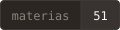
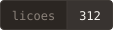
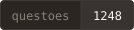
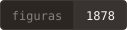
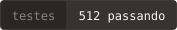
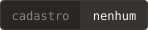

<div align="center">



<br>








<br><br>

### [Abrir o site](https://projeto-biblioteca-matem-tica.vercel.app)

[Como funciona](https://projeto-biblioteca-matem-tica.vercel.app/sobre.html) ·
[Perguntas frequentes](https://projeto-biblioteca-matem-tica.vercel.app/perguntas.html) ·
[Privacidade](https://projeto-biblioteca-matem-tica.vercel.app/privacidade.html)

<br>

> ### ⭐ Gostou do projeto?
>
> **Deixe uma estrela no repositório.** Leva um segundo, não custa nada e
> ajuda muito — é o que faz um projeto de estudo gratuito chegar a mais
> aluno e a mais professor.

</div>

<br>

---

## O que é

Uma plataforma gratuita de Matemática para o **Ensino Fundamental II**, do 6º
ao 9º ano. O aluno abre e estuda: **sem login, sem cadastro, sem cobrança e
sem anúncio.** O progresso fica no navegador dele, e nada é enviado para
servidor nenhum.

O que distingue este projeto de uma lista de exercícios é uma decisão só:
**quando o aluno erra, ele recebe o diagnóstico do engano que cometeu**, e não
uma mensagem genérica. Cada alternativa errada de cada questão tem uma
explicação escrita só para ela — são 3 771 diagnósticos no site inteiro.

<br>

<details open>
<summary><b>📐 &nbsp;Como uma lição é feita</b></summary>

<br>

Toda lição tem sempre as mesmas três partes, nesta ordem:

| | parte | o que ela faz |
|---|---|---|
| **01** | **A ideia** | Por que a coisa funciona, em texto corrido, antes de qualquer fórmula. A soma dos ângulos de um triângulo não é anunciada: ela aparece quando se traça a paralela pelo vértice de cima. |
| **02** | **Resolvido com você** | Um problema resolvido passo a passo, revelado um passo por vez. Cada passo separa o **raciocínio** da **conta** — misturar os dois produz texto que manda fazer sem ensinar a pensar. |
| **03** | **Sua vez** | Questões com figura própria. Errou? O retorno fala do erro que **você** cometeu. |

E duas regras que não se quebram:

- **Toda questão tem figura, e ela nunca mente.** Um triângulo dito retângulo é
  desenhado retângulo; um lado rotulado 7 cm sai maior que o de 4 cm. As 1 878
  figuras saem de 63 geradores que calculam a própria geometria a partir do
  enunciado.
- **Nenhuma resposta foi conferida de cabeça.** Cada uma é recalculada por um
  teste automático, a partir dos dados do enunciado e **por um caminho
  diferente do que a lição ensina**. A probabilidade de somar 7 em dois dados
  não sai de fórmula: os 36 pares são montados e contados.

</details>

<details>
<summary><b>📊 &nbsp;Os números</b></summary>

<br>

| | 6º ano | 7º ano | 8º ano | 9º ano | total |
|---|---:|---:|---:|---:|---:|
| Matérias | 14 | 13 | 12 | 12 | **51** |
| Lições | 88 | 80 | 72 | 72 | **312** |
| Questões | 352 | 320 | 288 | 288 | **1 248** |
| Diagnósticos de erro | | | | | **3 771** |
| Figuras (PNG gerados) | | | | | **1 878** |
| Vídeos verificados | 58 | 52 | 48 | 44 | **202** |
| Questões da OBMEP | | | | | **27** |
| Testes automáticos | | | | | **512** |

Os quatro anos estão **completos e revisados**: as 373 páginas foram
rastreadas num viewport de 320px e as 1 248 questões percorridas uma a uma no
navegador, sem achado.

</details>

<details>
<summary><b>🚀 &nbsp;Rodar na sua máquina</b></summary>

<br>

Precisa de **Node.js 18 ou mais novo**. Nada além disso — não há banco de
dados para subir nem variável de ambiente para configurar.

```bash
git clone https://github.com/KaioSilva14/Projeto-Biblioteca-Matem-tica.git
cd Projeto-Biblioteca-Matem-tica
npm install
npm run build     # compila o TypeScript para public/js
npm start         # http://localhost:3000
```

</details>

<details>
<summary><b>🧰 &nbsp;Os comandos</b></summary>

<br>

| comando | o que faz |
|---|---|
| `npm start` | Sobe o site em `localhost:3000` |
| `npm run dev` | O mesmo, reiniciando a cada alteração |
| `npm run build` | Compila `src/ts` → `public/js` |
| `npm test` | Roda os 512 testes (conteúdo, motor, páginas e SEO) |
| `npm run imagens` | Rasteriza as 1 878 figuras em PNG |
| `npm run imagens -- --faltando` | Gera só as figuras novas, preservando o índice |
| `npm run figuras` | Audita o texto de toda figura: transbordo e encavalamento |
| `npm run videos` | Confere todo vídeo citado contra a API do YouTube |
| `npm run marca` | Gera favicons e a imagem de compartilhamento |
| `npm run seo` | Reescreve metadados, sitemap, robots e manifesto |
| `npm run capa` | Gera a capa animada e os selos deste README |

</details>

<details>
<summary><b>🗂️ &nbsp;Como o projeto é organizado</b></summary>

<br>

```
├── src/ts/                 código-fonte TypeScript (o navegador nunca vê .ts)
├── public/
│   ├── index.html          home, sobre, perguntas, privacidade,
│   │                       agradecimentos e 404
│   ├── ano.html            as matérias de um ano        ?a=9
│   ├── curso.html          uma matéria                  ?c=volume-9
│   ├── licao.html          uma lição                    ?c=…&l=…
│   ├── css/                base.css (tokens) + licao.css (componentes)
│   ├── js/                 saída do compilador — não editar à mão
│   ├── dados/              catalogo.json · cursos/ · licoes/ · imagens.json
│   └── assets/             os PNG das figuras
├── ferramentas/            geradores: desenhos, manifesto, imagens, SEO, capa
├── tests/                  conteúdo · motor · páginas · SEO
└── server.js               Express servindo public/
```

**Publicar uma matéria nova é escrever JSON e gerar as imagens.** Não se
escreve HTML nem TypeScript para isso — `curso.html` serve qualquer matéria e
`licao.html` qualquer lição.

</details>

<details>
<summary><b>🔬 &nbsp;Como o conteúdo é verificado</b></summary>

<br>

Esta é a parte do projeto em que mais trabalho foi investido, e a regra que a
organiza é uma só: **nada é conferido pela fórmula que a matéria ensina.**

- O volume de um cone sai de **somar as fatias** (Cavalieri), que não sabem o
  que é cone. A fórmula publicada é comparada com essa soma, nunca usada no
  lugar dela.
- O terço da pirâmide sai de **contar** os pontos de um cubo repartido em três.
- As equações são resolvidas por **busca**, e o teste ainda exige que a solução
  seja **única** — senão a questão seria ambígua.
- As áreas saem da **fórmula do laço** (shoelace), que mede o polígono pelos
  vértices e não sabe o que é trapézio.
- Em geometria, o teste **lê o SVG de volta e mede o ângulo desenhado**. Se a
  figura e o texto discordarem, o teste quebra.
- Um teste lê a resposta de cada questão e **exige que ela não apareça na
  figura** — uma figura que entrega o resultado é pior que figura nenhuma.

Além dos testes, `npm run figuras` sobe o Chrome, carrega as 1 878 figuras e
mede cada texto: rótulo cortado na borda, texto fora da célula e dois textos
encavalados. Hoje o site sai com **zero achados**.

</details>

<details>
<summary><b>🎨 &nbsp;O design</b></summary>

<br>

O sistema visual está em [`DESIGN.md`](DESIGN.md) e não é sugestão:

- superfície única, **canvas quente `#2b2622`** — nunca preto puro, nunca
  cinza neutro: a temperatura é a identidade;
- **não existe acento cromático.** O off-white `#f7f5f0` é a cor da marca;
- Inter em 400/500, **DM Mono** nas contas, **Instrument Serif** itálico só no
  destaque de cada lição;
- elevação por hairline e contraste de superfície — **sem sombra e sem
  degradê**.

A única extensão é semântica, para o site poder dizer se a resposta está
certa, e ela é dessaturada de propósito para ficar na família quente.

</details>

<br>

---

## Créditos

<table>
<tr>
<td width="50%" valign="top">

### 👤 &nbsp;Criação

**[Kaio Silva](https://github.com/KaioSilva14)**

Criador e autor da Biblioteca Matemática. Escreveu as 312 lições, as 1 248
questões e os 3 771 diagnósticos de erro, e construiu a plataforma inteira —
do sistema de design aos geradores de figura e à suíte de testes.

</td>
<td width="50%" valign="top">

### 🤝 &nbsp;Apoio

**Professor Márcio**

Professor de Matemática, apoiou financeiramente o projeto e tornou possível
que ele fosse ao ar e permanecesse **gratuito para todo mundo, sem anúncio e
sem cobrança**. Sem esse apoio, este site não existiria.

</td>
</tr>
</table>

<br>

## Agradecimentos

Um site de estudo gratuito só existe porque muita gente decidiu, antes, deixar
o trabalho dela aberto.

<details>
<summary><b>📚 &nbsp;OBMEP</b> — as questões de aplicação</summary>

<br>

A Olimpíada Brasileira de Matemática das Escolas Públicas publica provas,
gabaritos e Bancos de Questões abertamente e sem custo, para fim educacional.
As **27 questões de aplicação** do site vêm de lá, cada uma com a prova, o ano
e o número do problema declarados na própria questão.

> [!IMPORTANT]
> **Essas questões não podem ser comercializadas.** Elas são da OBMEP e do
> IMPA, e continuam sendo — a OBMEP não publica licença aberta que autorize
> uso comercial. A permissão ampla da MIT vale para o código deste
> repositório e **não se estende a elas**. Veja a [licença](LICENSE).

Mais do que as questões, a OBMEP emprestou um padrão: enunciado sem
ambiguidade e solução que fecha. **Três problemas foram descartados durante a
construção** por não passarem nesse padrão — e só foi possível descobrir isso
porque a solução oficial é pública.

</details>

<details>
<summary><b>🎥 &nbsp;Os professores do YouTube</b> — 202 vídeos</summary>

<br>

Cada matéria traz vídeos de professores brasileiros que ensinam de graça. O
site não hospeda nem reaproveita o conteúdo deles: aponta para o canal, com o
título e o nome verdadeiros — verificados contra a API do YouTube por
`npm run videos`, para nenhum link quebrado ou inventado entrar.

O crédito de cada um aparece na seção "Para se aprofundar" da matéria.

</details>

<details>
<summary><b>🔤 &nbsp;As fontes</b> — todas abertas</summary>

<br>

Três famílias, todas sob a **SIL Open Font License**:

- **[Inter](https://rsms.me/inter/)**, de Rasmus Andersson — texto e títulos;
- **[DM Mono](https://fonts.google.com/specimen/DM+Mono)**, da Colophon
  Foundry — contas e rótulos técnicos;
- **[Instrument Serif](https://fonts.google.com/specimen/Instrument+Serif)**,
  de Rodrigo Fuenzalida e Jordan Egstad — o destaque de cada lição.

</details>

<details>
<summary><b>🛠️ &nbsp;O que sustenta a página</b></summary>

<br>

O site é HTML, CSS e TypeScript compilado — sem framework, sem bundler e sem
banco de dados. Mesmo assim, ele se apoia em trabalho alheio:

| | |
|---|---|
| **TypeScript** | garante que o conteúdo e o código combinam |
| **Node.js** e **Express** | servem os arquivos em desenvolvimento |
| **Chromium** | rasteriza as 1 878 figuras em PNG e audita o texto delas |
| **jsdom** | monta as páginas nos testes de integração |
| **Vercel** | hospeda o site sem cobrar por isso |

</details>

<details>
<summary><b>📖 &nbsp;BNCC</b> — a ordem das matérias</summary>

<br>

A ordem das 51 matérias e o recorte de cada uma seguem a **Base Nacional
Comum Curricular**. É ela que explica por que Fatoração vem antes de Frações
algébricas, e por que Semelhança de triângulos vem antes do Teorema de Tales:
a ordem não é gosto, é dependência.

</details>

<br>

---

## Contribuindo

Achou um erro? **Uma conta que não fecha, uma figura que desmente o próprio
rótulo, um diagnóstico que não faz sentido** — saber disso vale mais do que
qualquer elogio. Veja o [guia de contribuição](CONTRIBUTING.md).

## Licença

Este repositório tem **três camadas de direitos**, e vale ler antes de
reutilizar qualquer parte dele.

| | o que é | o que você pode fazer |
|---|---|---|
| 🟢 **Código** | TypeScript, CSS, HTML, geradores e ferramentas | [Licença MIT](LICENSE) — usar, modificar e redistribuir, inclusive comercialmente |
| 🟡 **Conteúdo pedagógico** | lições, enunciados próprios e diagnósticos | de autoria de Kaio Silva — livre para estudo e sala de aula, com atribuição |
| 🔴 **Questões da OBMEP** | as 27 questões com o campo `fonte` | **não podem ser comercializadas** |

> [!CAUTION]
> ### As questões da OBMEP não podem ser comercializadas
>
> As 27 questões marcadas com o campo `fonte` **não são deste projeto**: são
> da OBMEP e do IMPA, que as publicam abertamente para fim educacional mas
> **não** sob licença aberta que autorize uso comercial.
>
> **A permissão ampla da licença MIT cobre o código e não se estende a elas.**
>
> Na prática, isso quer dizer: não as venda, não as ponha em apostila
> comercial, curso pago, aplicativo com assinatura ou página com anúncio, e
> não as redistribua sem a atribuição que acompanha cada uma.
>
> Se você vai usar este projeto para algum fim comercial, **remova antes as
> questões com o campo `fonte`** — ou procure a OBMEP para obter autorização.

<br>

<div align="center">

**Se este projeto te ajudou, deixe uma ⭐ — isso ajuda muito.**

<sub>Feito para quem está aprendendo, e não para quem já sabe.</sub>

</div>
